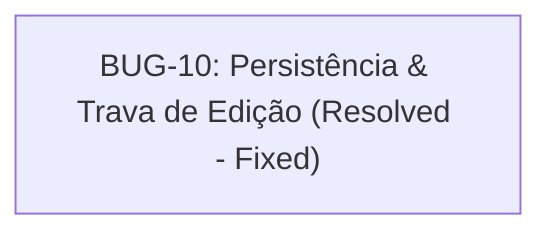

<!-- GENERATED, DO NOT EDIT: regenerado por /reversa-debugger em 2026-08-10T19:33:00-03:00 a partir de 1 bug -->

# Grafo de Bugs · Contexto `integracoes-e-configuracoes`

## Clusters e Diagnóstico Estrutural

- **Cluster Chaves Sensíveis de Integração:** O bug `BUG-010` foi 100% resolvido com persistência real em PostgreSQL e trava visual contra edições acidentais no Admin.
