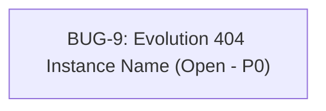

<!-- GENERATED, DO NOT EDIT: regenerado por /reversa-debugger em 2026-08-10T17:02:45-03:00 a partir de 1 bug -->

# Grafo de Bugs · Contexto `notificacoes-whatsapp`

## Clusters e Diagnóstico Estrutural

- **Cluster WhatsApp Integration:** O bug `BUG-009` impacta a notificação imediata do Admin e a entrega de recibos em PDF aos clientes no checkout devido à URL fixa no `whatsappService.js`.

## Impact Score por Bug Aberto

| Bug ID | Display # | Severidade | Prioridade | Impact Score |
|--------|-----------|------------|------------|--------------|
| `BUG-20260810-WA02-evolution-404-instance-name` | 9 | high | p0 | 5.0 |
